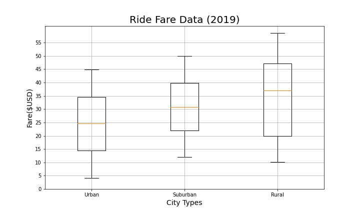
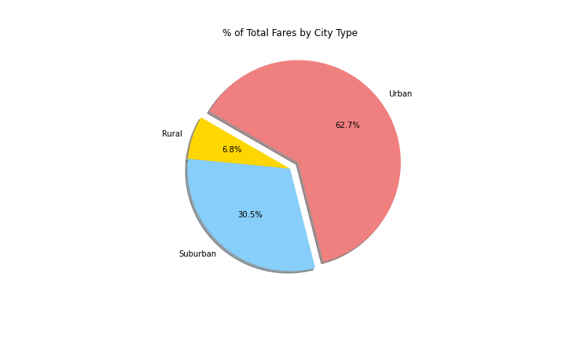
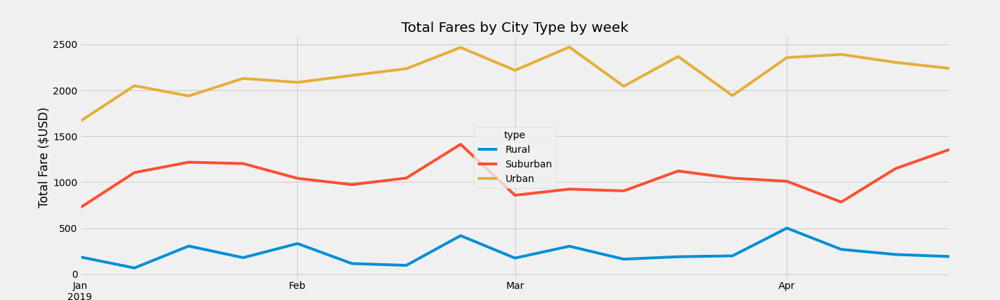

# PyBer_Analysis

## Overview

- Pyber is a python based ridesharing app company
- The purpose of this analysis is to deliver an exploratory analysis that could help PyBer to decide how improve access to the service and manage affordability.

## Results

### Average Fare by City Type

- In general, Rural Cities have higher average fares and less total Rides than Suburban an Urban cities.

### Ride Count

- Urban cities have higher ride count and a higher std deviation is observed

### Ride Fares

- Rural cities have higher average ride fares, this could be affected by distance.

### Drivers Count

- Rural cities have lower Number of drivers.
- Urban cities std deviation is very large, urban cities with lower number of drivers could be underserved

### Fare, rides, and driver’s distribution by City Type

- As expected, Urban cities accounts for the largest portion of the distribution in the three indicators, this is easier to observe in the following table.
- As a result of higher average fares in Rural and Suburban Cities vs Urban cities, rural participation of total fares doubles rural participation of Total drivers

| City Type | Total Fares % | Total Rides % | Total Drivers %  |
|:---|:---:|:---:|:---:|
| Urban | 62.7 | 68.4 | 80.9 |
| Suburban | 30.5 | 26.3 | 16.5 |
| Rural | 6.8 | 5.3 | 2.6 |

## Total Fares By City Type By Week

- An analysis with longer series could deliver more insights about seasonal differences among city types

## Summary

- Population density could be a relevant factor in the indicators presented by city:
  - Population density affects two important variables distance and total population
  - Distance could be reflected on higher average fares.
  - And population density could be reflected on lower number of drivers and lower numer of rides

- A deeper analysis using ride duration, distance and population density or population by city is recommended to complete this analysis.

- Urban cities with lower number of drivers could be underserved.

